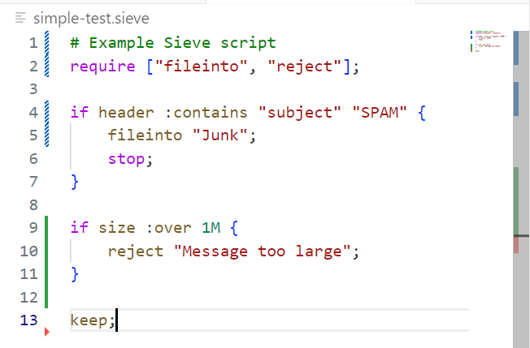

# Sieve Language Support

A Visual Studio Code extension that provides syntax highlighting for the Sieve email filtering language, as defined in RFC 5228 and related extensions.

## Features

- **Syntax Highlighting**: Complete syntax highlighting for Sieve scripts including:
  - Keywords (`if`, `elsif`, `else`, `require`, `stop`)
  - Commands (`keep`, `discard`, `redirect`, `fileinto`, `reject`, `vacation`)
  - Tests (`address`, `header`, `body`, `size`, `exists`)
  - Operators (`:is`, `:contains`, `:matches`, `:regex`, etc.)
  - Comments (line comments with `#` and block comments)
  - Strings and multiline text blocks
  - Numbers with optional size suffixes (K, M, G)

- **File Association**: Automatically recognizes `.sieve` and `.siv` file extensions

- **Language Configuration**: Provides proper bracket matching, auto-closing pairs, and comment toggling

## Supported Sieve Features

This extension supports syntax highlighting for:
- **Core Sieve (RFC 5228)**: Basic filtering constructs
- **Common Extensions**: Including fileinto, reject, vacation, envelope, and body tests
- **Advanced Features**: Regular expressions, date tests, and metadata handling

## Installation

1. Open Visual Studio Code
2. Go to the Extensions view (Ctrl+Shift+X)
3. Search for "Sieve Language Support"
4. Click Install

## Usage

Simply open any `.sieve` or `.siv` file in VS Code and the syntax highlighting will be automatically applied.

## Example

```sieve
# Example Sieve script
require ["fileinto", "reject"];

if header :contains "subject" "SPAM" {
    fileinto "Junk";
    stop;
}

if size :over 1M {
    reject "Message too large";
}

keep;
```

Here's how the syntax highlighting looks in VS Code:



## Requirements

No additional requirements or dependencies.

## Extension Settings

This extension does not contribute any VS Code settings. It works out of the box with default configurations.

## Known Issues

- Complex nested string interpolation in multiline text blocks may not be perfectly highlighted
- Some advanced Sieve extensions beyond RFC 5228 may need additional grammar rules

## Contributing

Contributions are welcome! Please feel free to submit issues or pull requests to improve the Sieve language support.

## Release Notes

### 1.0.0

Ready For GA

### 0.0.1

Initial release of Sieve Language Support:
- Complete syntax highlighting for Sieve email filtering scripts
- Support for .sieve and .siv file extensions
- Language configuration with proper bracket matching and commenting
- Examples and documentation

## License

This extension is released under the MIT License.
